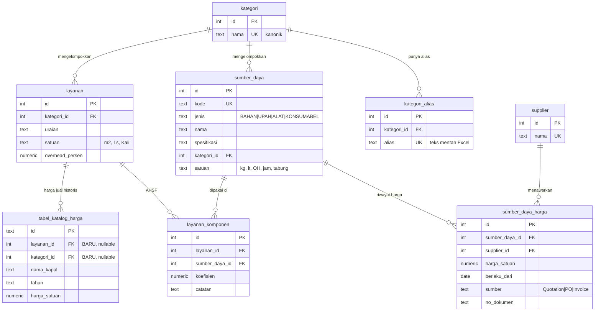
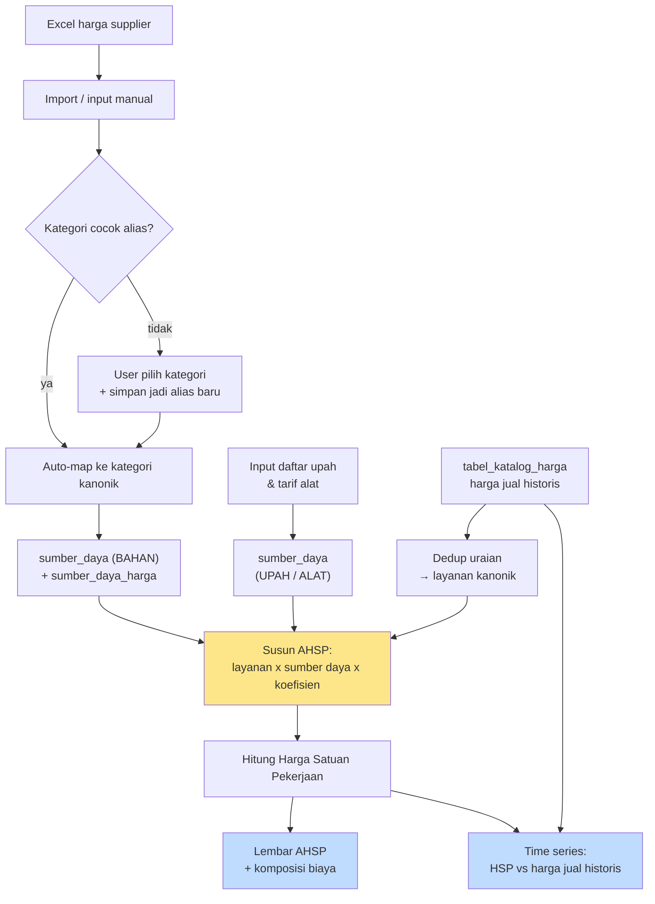

# Desain: Katalog Material + Analisa Harga Satuan Pekerjaan (Cost Buildup)
**Project:** shipyard-pricing (PT Dukuh Raya)
**Status:** proposal / belum diimplementasi

---

## 1. Apa yang sebenarnya dibangun

Tujuannya **bukan** menghitung untung-rugi, tapi **menjelaskan susunan harga**:

> Kenapa pekerjaan yang materialnya Rp 12.000 kita jual Rp 33.000?
> Karena selain material, ada upah tukang, sewa mesin, tabung oksigen, dan overhead.

Konsep ini di Indonesia sudah punya nama & standar: **AHSP — Analisa Harga Satuan
Pekerjaan**. Strukturnya selalu sama:

```
A. BAHAN      = Σ (koefisien × harga satuan bahan)
B. UPAH       = Σ (koefisien × harga satuan tenaga kerja)
C. PERALATAN  = Σ (koefisien × harga satuan alat/konsumabel)
------------------------------------------------------
   Subtotal   = A + B + C
D. Overhead & Keuntungan (%)
------------------------------------------------------
   HARGA SATUAN PEKERJAAN  ← inilah harga jual
```

**Koefisien** = berapa banyak sumber daya dipakai untuk menghasilkan **1 satuan pekerjaan**
(mis. 0,25 kg cat per 1 m² pengecatan). Ini angka yang bikin seluruh sistem jalan.

### Contoh nyata (angka kamu)

**Pengecatan lambung — satuan m²**

| | Uraian | Koef | Satuan | Harga Satuan | Jumlah |
|---|---|---|---|---|---|
| **A** | **BAHAN** | | | | **12.000** |
| | Cat epoxy | 0,250 | kg | 40.000 | 10.000 |
| | Thinner | 0,050 | lt | 40.000 | 2.000 |
| **B** | **UPAH** | | | | **10.500** |
| | Tukang cat | 0,060 | OH | 150.000 | 9.000 |
| | Kepala tukang | 0,010 | OH | 150.000 | 1.500 |
| **C** | **PERALATAN & KONSUMABEL** | | | | **6.200** |
| | Sewa kompresor + spray gun | 0,028 | jam | 150.000 | 4.200 |
| | Tabung oksigen | 0,020 | tabung | 100.000 | 2.000 |
| | | | | **Subtotal A+B+C** | **28.700** |
| **D** | Overhead & Keuntungan 15% | | | | 4.305 |
| | | | | **HARGA SATUAN** | **≈ 33.000** |

Itulah justifikasi Rp 12.000 → Rp 33.000. Bukan "markup 175%", tapi
**"material 36%, upah 32%, alat 19%, overhead+profit 13%"**.

---

## 2. Model database

### 2.1 Ide kuncinya: satu master "sumber daya", bukan tabel terpisah-pisah

Bahan, tenaga kerja, dan alat itu **struktur datanya identik**: punya nama, satuan, dan
harga yang berubah seiring waktu. Jadi disatukan dalam satu tabel `sumber_daya`, dibedakan
lewat kolom `jenis`.

Keuntungannya:
- Katalog Material = tinggal `WHERE jenis = 'BAHAN'`
- Nanti mau tambah Daftar Upah / Daftar Alat → tidak perlu tabel & kode baru
- Perhitungan AHSP jadi **satu query**, bukan UNION dari 3 tabel

### 2.2 Diagram relasi



### 2.3 DDL

```sql
-- ============ MASTER KATEGORI (dipakai bersama semua katalog) ============
CREATE TABLE kategori (
  id     SERIAL PRIMARY KEY,
  nama   TEXT NOT NULL UNIQUE,          -- kanonik, mis. 'GENERAL SERVICES'
  urutan INT  NOT NULL DEFAULT 0,
  aktif  BOOLEAN NOT NULL DEFAULT TRUE
);

-- Teks kategori dari Excel berantakan & beda tiap file. Alias bikin teks lama
-- ke-map otomatis tanpa bersihin ribuan baris manual, sekaligus bikin parser
-- import berikutnya auto-map sendiri.
CREATE TABLE kategori_alias (
  id          SERIAL PRIMARY KEY,
  kategori_id INT  NOT NULL REFERENCES kategori(id) ON DELETE CASCADE,
  alias       TEXT NOT NULL UNIQUE
);

-- ============ MASTER SUMBER DAYA (bahan + upah + alat jadi satu) ============
CREATE TABLE supplier (
  id     SERIAL PRIMARY KEY,
  nama   TEXT NOT NULL UNIQUE,
  kontak TEXT,
  catatan TEXT
);

CREATE TABLE sumber_daya (
  id          SERIAL PRIMARY KEY,
  kode        TEXT UNIQUE,
  jenis       TEXT NOT NULL CHECK (jenis IN ('BAHAN','UPAH','ALAT','KONSUMABEL')),
  nama        TEXT NOT NULL,
  spesifikasi TEXT,                       -- ukuran/tebal/grade/merk
  kategori_id INT REFERENCES kategori(id),
  satuan      TEXT NOT NULL,              -- kg, lt, m2, OH, jam, tabung, batang
  aktif       BOOLEAN NOT NULL DEFAULT TRUE,
  dibuat_pada TIMESTAMPTZ NOT NULL DEFAULT now()
);
CREATE INDEX idx_sd_jenis     ON sumber_daya(jenis);
CREATE INDEX idx_sd_kategori  ON sumber_daya(kategori_id);

-- Harga dipisah dari master: harga berubah terus, perlu bisa banding antar
-- supplier, lacak kenaikan, DAN hitung ulang AHSP "per tanggal tertentu".
CREATE TABLE sumber_daya_harga (
  id             SERIAL PRIMARY KEY,
  sumber_daya_id INT  NOT NULL REFERENCES sumber_daya(id) ON DELETE CASCADE,
  supplier_id    INT  REFERENCES supplier(id),          -- NULL untuk UPAH
  harga_satuan   NUMERIC(18,2) NOT NULL CHECK (harga_satuan > 0),
  mata_uang      TEXT NOT NULL DEFAULT 'IDR',
  berlaku_dari   DATE NOT NULL,
  sumber         TEXT,                                   -- Quotation|PO|Invoice|Manual
  no_dokumen     TEXT,
  catatan        TEXT,
  dibuat_pada    TIMESTAMPTZ NOT NULL DEFAULT now()
);
CREATE INDEX idx_sdh_sd_tgl ON sumber_daya_harga(sumber_daya_id, berlaku_dari DESC);

-- Harga terkini per sumber daya (DISTINCT ON = fitur Postgres, cepat & rapi)
CREATE VIEW v_harga_terkini AS
SELECT DISTINCT ON (sumber_daya_id)
       sumber_daya_id, supplier_id, harga_satuan, berlaku_dari, no_dokumen
FROM   sumber_daya_harga
ORDER  BY sumber_daya_id, berlaku_dari DESC, id DESC;

-- ============ LAYANAN KANONIK ============
-- tabel_katalog_harga isinya harga REALISASI historis: uraian sama muncul
-- puluhan kali beda kapal/tahun. AHSP butuh 1 baris = 1 jenis pekerjaan.
CREATE TABLE layanan (
  id              SERIAL PRIMARY KEY,
  kode            TEXT UNIQUE,
  kategori_id     INT REFERENCES kategori(id),
  uraian          TEXT NOT NULL,
  satuan          TEXT,                        -- m2, Ls, Kali, Hari
  overhead_persen NUMERIC(5,2) NOT NULL DEFAULT 15.00,
  aktif           BOOLEAN NOT NULL DEFAULT TRUE
);

-- Tabel lama TIDAK dirombak — cuma ditambah kolom nullable,
-- jadi app yang sekarang tetap jalan tanpa perubahan apa pun.
ALTER TABLE tabel_katalog_harga ADD COLUMN layanan_id  INT REFERENCES layanan(id);
ALTER TABLE tabel_katalog_harga ADD COLUMN kategori_id INT REFERENCES kategori(id);
CREATE INDEX idx_tkh_layanan ON tabel_katalog_harga(layanan_id);

-- ============ INTI AHSP ============
CREATE TABLE layanan_komponen (
  id             SERIAL PRIMARY KEY,
  layanan_id     INT NOT NULL REFERENCES layanan(id) ON DELETE CASCADE,
  sumber_daya_id INT NOT NULL REFERENCES sumber_daya(id),
  koefisien      NUMERIC(18,6) NOT NULL CHECK (koefisien > 0),
  catatan        TEXT,
  UNIQUE (layanan_id, sumber_daya_id)
);
CREATE INDEX idx_lk_layanan ON layanan_komponen(layanan_id);
```

---

## 3. Alur kerja



Kotak kuning = **satu-satunya langkah yang wajib input manusia**: menentukan koefisien.
Sisanya otomatis. Ini juga bagian tersulit — lihat bagian 6.

---

## 4. Perhitungan

### 4.1 Harga Satuan Pekerjaan (harga terkini)

```sql
WITH komponen AS (
  SELECT lk.layanan_id,
         sd.jenis,
         SUM(lk.koefisien * h.harga_satuan) AS subtotal
  FROM   layanan_komponen lk
  JOIN   sumber_daya      sd ON sd.id = lk.sumber_daya_id
  JOIN   v_harga_terkini  h  ON h.sumber_daya_id = lk.sumber_daya_id
  GROUP  BY lk.layanan_id, sd.jenis
)
SELECT l.id,
       l.uraian,
       l.satuan,
       COALESCE(SUM(k.subtotal) FILTER (WHERE k.jenis = 'BAHAN'), 0)                        AS bahan,
       COALESCE(SUM(k.subtotal) FILTER (WHERE k.jenis = 'UPAH'), 0)                         AS upah,
       COALESCE(SUM(k.subtotal) FILTER (WHERE k.jenis IN ('ALAT','KONSUMABEL')), 0)         AS alat,
       COALESCE(SUM(k.subtotal), 0)                                                          AS subtotal,
       ROUND(COALESCE(SUM(k.subtotal),0) * (1 + l.overhead_persen/100), 2)                   AS harga_satuan_pekerjaan
FROM   layanan l
LEFT   JOIN komponen k ON k.layanan_id = l.id
GROUP  BY l.id, l.uraian, l.satuan, l.overhead_persen;
```

### 4.2 HSP "per tanggal" — ini yang bikin time series bisa jalan

Ganti `v_harga_terkini` dengan harga yang berlaku pada tanggal tertentu:

```sql
-- harga sumber daya yang berlaku pada :tanggal
SELECT DISTINCT ON (sumber_daya_id) sumber_daya_id, harga_satuan
FROM   sumber_daya_harga
WHERE  berlaku_dari <= :tanggal
ORDER  BY sumber_daya_id, berlaku_dari DESC, id DESC
```

Jalankan itu untuk beberapa tanggal (mis. tiap kuartal 2 tahun terakhir) → dapat deret
HSP dari waktu ke waktu. Inilah sumber data chart-nya.

### 4.3 Harga jual referensi (dari data historis)

1 layanan punya banyak harga realisasi (beda kapal/tahun). Rekomendasi pakai **median**
karena tahan outlier — data docking kamu ada baris ekstrem.

```sql
SELECT layanan_id,
       tahun,
       PERCENTILE_CONT(0.5) WITHIN GROUP (ORDER BY harga_satuan) AS harga_jual_median,
       COUNT(*) AS jumlah_referensi
FROM   tabel_katalog_harga
WHERE  layanan_id IS NOT NULL AND harga_satuan > 0
GROUP  BY layanan_id, tahun;
```

---

## 5. Analitik: time series

Satu chart, dua garis, per layanan:

- **Garis 1 — Harga Satuan Pekerjaan hasil hitung** (bergerak karena harga bahan/upah berubah)
- **Garis 2 — Harga jual realisasi** dari `tabel_katalog_harga` (per tahun, median)

Yang dicari dari chart ini:

| Pola yang terlihat | Artinya |
|---|---|
| Garis biaya naik, harga jual datar | Harga jual sudah ketinggalan → perlu revisi |
| Jarak dua garis melebar | Overhead & keuntungan efektif membesar |
| Garis biaya melonjak di titik tertentu | Ada bahan/upah yang naik tajam — bisa di-drill down |

Tambahan yang murah tapi berguna:
- **Stacked area / donut komposisi**: berapa % bahan vs upah vs alat vs overhead
- **Alert**: layanan yang biayanya naik > X% sejak harga jual terakhir ditetapkan

---

## 6. Yang perlu diwaspadai

**a. Koefisien adalah pekerjaan terberat, bukan codingnya.**
Menentukan "0,25 kg cat per m²" butuh orang yang paham teknis lapangan. Tanpa itu, semua
tabel di atas kosong dan analitik tidak muncul. Saran: mulai dari **10–20 pekerjaan
tersering / bernilai terbesar**, jangan seluruh katalog.

**b. Tampilkan cakupan (coverage).**
Kalau baru 15 dari 412 layanan punya AHSP, halaman analitik akan tampak meyakinkan padahal
hanya mewakili 4%. Selalu tulis di header:
> "AHSP tersusun untuk **15 dari 412** layanan (3,6%)."

**c. HSP hasil hitung ≠ harga jual yang sudah terjadi.**
Keduanya sengaja dipisah: satu hasil perhitungan, satu realisasi historis (yang dipengaruhi
negosiasi, kondisi kapal, hubungan klien). Bedanya justru informasi berharga — jangan
dipaksa sama.

**d. Overhead & keuntungan sebaiknya per layanan, bukan global.**
Karena itu `overhead_persen` ada di tabel `layanan` (default 15%), bukan konstanta.

**e. Hak akses.**
Harga beli, upah, dan komposisi biaya jauh lebih sensitif daripada harga jual. Sebelumnya
diputuskan "semua user login" untuk katalog material — untuk halaman **AHSP / Struktur
Biaya**, sebaiknya dibatasi admin/manajemen.

---

## 7. Desain UI

### 7.1 Navigasi (sidebar)

```
Dashboard & Data      (existing — harga jual jasa)
Katalog Material      (BARU — sumber_daya jenis BAHAN)
Daftar Upah & Alat    (BARU — jenis UPAH/ALAT/KONSUMABEL, bisa fase berikutnya)
Struktur Biaya AHSP   (BARU)
Import Excel          (existing, + mode material)
Kelola Akses          (existing, admin)
```

### 7.2 Katalog Material

Pola sama persis dengan halaman existing supaya komponen bisa dipakai ulang:

- **KPI cards**: Total Material · Supplier · Kategori Terpakai · Update Harga Terakhir
- **Filter cascading** (reuse logic yang sudah ada): Kategori → Supplier → Satuan → Search
- **Tabel**: Kode · Nama · Spesifikasi · Kategori · Satuan · Harga Terkini · Supplier · Berlaku Dari
- **Mode Edit** (reuse `EditableCatalogTable`): inline edit, hapus massal, paste dari Excel
- **Klik baris → drawer "Riwayat Harga"**: daftar `sumber_daya_harga` + grafik tren.
  Berguna untuk purchasing: kelihatan supplier mana lebih murah & kapan harga naik.

### 7.3 Struktur Biaya AHSP

**Panel kiri — daftar layanan**

| Kategori | Uraian | Sat | Bahan | Upah | Alat | HSP | AHSP |
|---|---|---|---|---|---|---|---|
| HULL | Pengecatan lambung | m² | 12.000 | 10.500 | 6.200 | **33.005** | ✅ 6 |
| GENERAL | Mooring boat | Kali | — | — | — | — | ⚠️ belum |

Baris tanpa AHSP tetap ditampilkan dengan badge ⚠️ — sekaligus jadi daftar to-do.

**Panel kanan — lembar AHSP satu layanan**

Tampil persis seperti format AHSP yang sudah familiar di industri (lihat tabel di bagian 1):
baris dikelompokkan A/B/C, kolom Koef · Satuan · Harga Satuan · Jumlah, subtotal per
kelompok, lalu overhead dan HSP di bawah.

- Editor inline: tambah/hapus komponen, ubah koefisien, subtotal live
- Dropdown pilih sumber daya difilter otomatis sesuai kelompok (A → BAHAN, dst.)
- **Donut komposisi**: bahan / upah / alat / overhead dalam %
- **Time series chart** (bagian 5): HSP hitung vs harga jual realisasi
- Tombol **"Bandingkan dengan harga jual"**: tampilkan selisih HSP vs median historis

---

## 8. Rencana bertahap

| Fase | Isi | Nilai bagi user | Effort |
|---|---|---|---|
| **1** | `supplier`, `sumber_daya`, `sumber_daya_harga` + tab Katalog Material + import | Permintaan klien langsung terpenuhi | Sedang |
| **2** | `kategori` + `kategori_alias`, mapping kategori lama | Dua katalog benar-benar sekategori | Sedang |
| **3** | Input UPAH & ALAT (jenis lain di tabel yang sama — tanpa kode baru) | Bahan baku AHSP lengkap | Ringan |
| **4** | `layanan` kanonik + isi `layanan_id` di tabel lama | Fondasi AHSP | Sedang–berat |
| **5** | `layanan_komponen` + editor AHSP + isi 10–20 pekerjaan utama | Justifikasi harga mulai bisa ditunjukkan | **Berat (manual)** |
| **6** | Time series + donut komposisi + alert kenaikan biaya | Analitik penuh | Sedang |

Fase 1 sudah memenuhi permintaan klien. Fase 5 jangan dijanjikan cepat — bottleneck-nya
input koefisien, bukan pemrograman.

---

## 9. Keputusan yang masih perlu diambil

1. **Daftar kategori kanonik** — siapa yang menetapkan? Perlu satu orang paham operasional
   memutuskan daftar final (mis. 10–15 kategori), sisanya jadi alias.
2. **Siapa yang menentukan koefisien** — tanpa penanggung jawab jelas, fase 5 tidak jalan.
3. **Satuan upah** — OH (Orang-Hari) atau Orang-Jam? Harus konsisten sejak awal.
4. **Overhead & keuntungan** — apakah default 15% berlaku umum, atau beda per kategori?
5. **Mata uang** — ada supplier quote USD? Kalau ya, butuh tabel kurs; jangan simpan nilai
   yang sudah terkonversi.
6. **Hak akses halaman AHSP** — semua user atau admin/manajemen saja?
