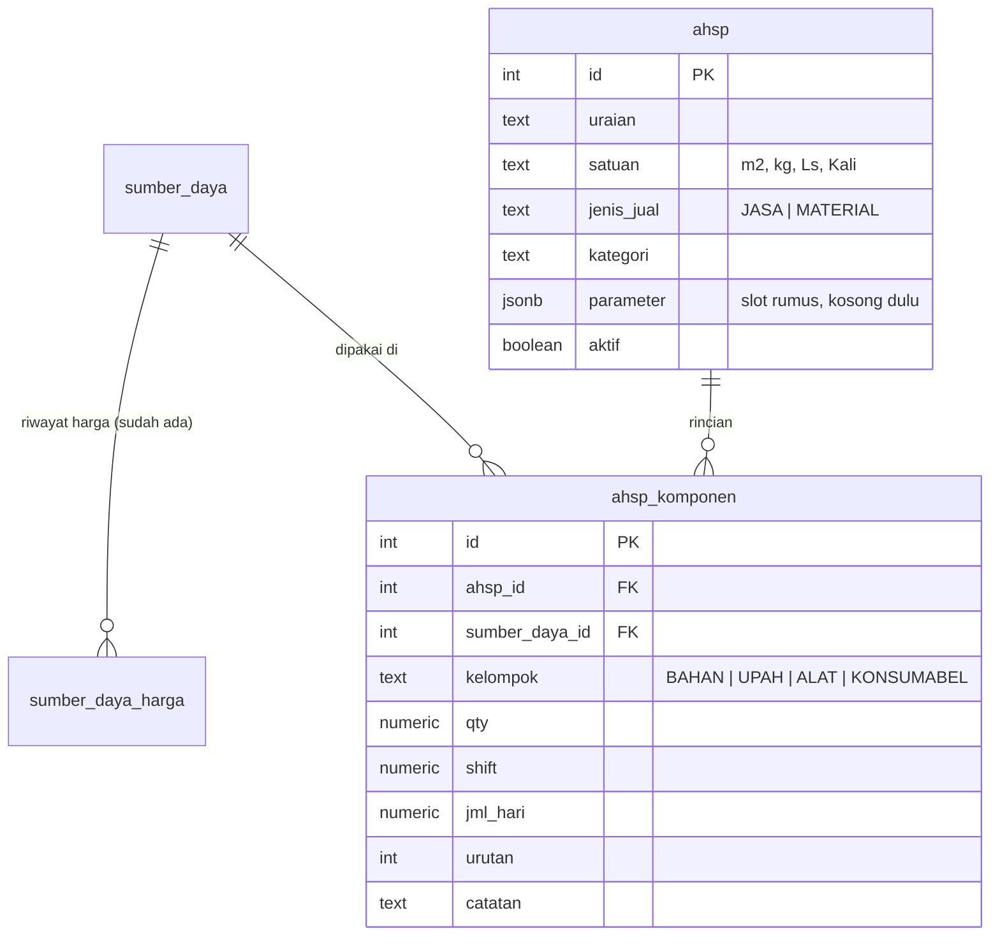

# Rencana Langkah 3 — Tab "Struktur Biaya" (AHSP)

**Project:** shipyard-pricing (PT Dukuh Raya)
**Status:** **Sesi 3.0 dan 3.1 sudah selesai** (3 Agustus 2026) — filter jenis sudah jadi
parameter, tabel `ahsp`/`ahsp_komponen` dan API-nya sudah jalan, `pytest` 42 lulus termasuk
uji penerimaan DR.05. A9 dan A3 sudah diputuskan 4 Agustus 2026 (jumlahkan jujur; harga
komponen hidup), begitu juga cara menambah komponen baru (tambah cepat dari layar AHSP).
**Tidak ada lagi yang menahan Sesi 3.2.** Lihat bagian 9.
**Menggantikan:** bagian 7.3 dan bagian 8 fase 4–6 di `docs/desain-katalog-material.md`
**Cara pakai:** taruh file ini di `docs/`, lalu pakai prompt di
`prompt-claude-code-sesi-3-0.md`. Satu sesi kerja = satu prompt. Jangan lompat sesi, dan
jangan kerjakan sesi yang di bagian 9 masih ditandai ditahan.
**Ruang lingkup:** AHSP diisi manual lewat form, satu per satu. **Tidak ada rencana membangun
fitur impor Excel untuk AHSP** — baik sekarang maupun di sesi mana pun pada Langkah 3. File
Excel di bagian 1B cuma referensi struktur, bukan bahan yang programnya perlu dibaca.

---

## 0. Apa yang berubah dari dokumen desain lama

Dokumen `desain-katalog-material.md` ditulis sebelum ada permintaan ini. Lima hal berubah:

| Dokumen lama | Sekarang |
|---|---|
| AHSP jadi panel di dalam struktur yang sudah ada | **Tab baru sendiri** di sidebar |
| Baris AHSP diturunkan otomatis dari dedup `tabel_katalog_harga` → tabel `layanan` | **Dibuat manual satu per satu.** Tidak ada dedup otomatis. Jauh lebih murah dan tidak bergantung data lama yang berantakan |
| Komponen hanya bisa material/upah/alat (`sumber_daya`) | Komponen = **sumber daya milik Dukuh Raya sendiri** yang dipakai untuk mengerjakan penjualan itu: bahan, tenaga kerja sendiri, alat sendiri, konsumabel. Bukan jasa yang dibeli dari luar |
| Yang dihitung hanya harga **jasa** yang dijual | Yang dihitung bisa **jasa atau material** yang dijual |
| Rumus dikunci: `subtotal × (1 + overhead%)` | **Tidak ada markup sama sekali.** Terverifikasi dari file asli: harga jual = jumlah subtotal, persis. PPN ditambahkan di tingkat penawaran, bukan di AHSP |

Nama tabel juga berubah: `layanan` / `layanan_komponen` → **`ahsp` / `ahsp_komponen`**.
Alasannya, yang dijual sekarang bisa material juga, jadi kata "layanan" jadi menyesatkan.

---

## 1. Temuan dari kode yang ada sekarang (sudah diverifikasi, bukan tebakan)

Lima hal ini menentukan bentuk rencana di bawah:

1. **Belum ada satu pun cara memasukkan Upah, Alat, atau Konsumabel.**
   `sumber_daya.jenis` sudah menerima `BAHAN|UPAH|ALAT|KONSUMABEL`, tapi `WHERE sd.jenis = 'BAHAN'`
   dikunci di **7 tempat**: `services/material.py` baris 52, 131, 199, 295, 554 dan
   `services/analitik.py` baris 159, 185. Jadi tab Katalog Material cuma bisa bahan.
   **AHSP tanpa upah dan alat itu cuma daftar belanja.** Ini yang bikin Sesi 3.0 harus duluan.

   Dua di antaranya bukan sekadar filter tampilan dan **akan bikin error kalau dilewat**:
   `_peta_identitas()` (baris 295) dan `preview_bulk()` (baris 554) memakainya untuk mencari
   material yang sudah ada sebelum menyimpan. Kalau tetap dikunci `'BAHAN'`, menempel baris
   upah yang sama dua kali akan dianggap barang baru, lalu ditolak `uq_sd_identitas` sebagai
   IntegrityError — pengguna cuma melihat "sepertinya sudah tersimpan" tanpa tahu sebabnya.

   > **Koreksi dari pelaksanaan Sesi 3.0 (3 Agustus 2026):** tempatnya **enam**, bukan lima.
   > Yang tidak tercatat di atas adalah `INSERT INTO sumber_daya (nama, spesifikasi, satuan)`
   > di dalam `_resolve_sumber_daya()` — dia tidak pernah menyebut kolom `jenis` sehingga
   > diam-diam jatuh ke `DEFAULT 'BAHAN'`. Kalau dilewat, baris upah yang dipaste tersimpan
   > sebagai BAHAN dan mengotori tab Katalog Material.

2. **Riwayat harga sudah netral jenis.** `price_history()`, `add_price()`, dan `delete_price()`
   (baris 671, 690, 720) tidak memfilter `jenis` sama sekali. Artinya drawer Riwayat Harga
   langsung jalan untuk upah, alat, dan konsumabel **tanpa satu baris kode pun** — sudah dicek, bukan
   perkiraan.

3. **Efek samping bagusnya:** karena `jenis = 'BAHAN'` sudah dikunci di query, menambah baris
   UPAH/ALAT/KONSUMABEL **tidak akan mengotori tab Katalog Material** yang sekarang. Aman.

4. **Unique index `uq_sd_identitas` sudah menyertakan `jenis`.** Jadi "Pengecatan" sebagai BAHAN
   dan "Pengecatan" sebagai ALAT tidak akan dianggap kembar. Tidak perlu diubah.

5. **`require_admin` sudah ada** di `backend/app/auth.py` dan sudah dipakai di
   `routers/catalog.py`. Tinggal dipakai ulang.

---

## 1B. Temuan dari file Excel asli — `ANALISA_HARGA_SATUAN_-_DR_2020.xlsx`

File yang ditunggu sudah diterima. Isinya 3 sheet: **ANALISA HARGA SATUAN** (versi 2017,
57 blok AHSP), **HPS-SABUK NUSANTARA 49** (dokumen penawaran), dan **DR-2020** (salinan sheet
pertama dengan harga diperbarui ke 2020 — 408 baris berbeda). Semua angka di bawah sudah
dihitung ulang dari file, bukan pembacaan sekilas.

### 1B.1 Struktur AHSP — sesuai dugaan, dengan tiga penyesuaian

Tiap blok berbentuk: kode (`DR.01`–`DR.5x`) → uraian kegiatan → **VOLUME** + satuan →
kelompok biaya bernomor, tiap kelompok punya `Sub Total` → `Jumlah harga satuan per <satuan>
( 1 + 2 + 3 )`. Ini persis bentuk A/B/C di rancangan. Tiga hal yang berbeda:

**(a) Urutan kelompok tidak tetap.** Dari 57 blok: 29 urut Upah → Alat → Bahan, 13 hanya
Upah → Alat, 8 hanya Alat, 3 hanya Bahan, 2 Upah → Bahan, 1 Upah → Bahan → Alat. Nomor 1/2/3
mengikuti urutan tampil, **bukan** jenisnya. Ini membenarkan keputusan menyimpan `kelompok` dan
`urutan` di baris komponen, bukan menurunkannya dari `sumber_daya.jenis`.

**(b) Baris komponen punya EMPAT pengali, bukan satu koefisien.**
Kolomnya: `Qty` · `Satuan` · `Shift` · `Jml Hari` · `Harga Satuan` → `Total`.
Dari 298 baris komponen, **253 (84,9%)** mengikuti `Qty × Shift × Jml Hari × Harga`.
Sisanya: 24 baris (8,1%) mengabaikan Qty, 18 baris (6,0%) hanya `Qty × Harga`,
3 baris (1,0%) hanya `Jml Hari × Harga`. Tidak ada baris yang tidak cocok dengan salah satu
dari empat pola itu.

→ **`ahsp_komponen` butuh `qty`, `shift`, dan `jml_hari` sebagai kolom terpisah**, bukan satu
`koefisien`. Menggabungkannya jadi satu angka akan menghapus informasi yang dipakai orang
untuk memeriksa: "4 orang, 1 shift, 0,07 hari" jauh lebih bisa diperiksa daripada "0,28".

**(c) "Jml Hari" itulah koefisiennya**, dan isinya pecahan: 0,002 sampai 5, umum di 0,015 /
0,07 / 0,2. Header kolomnya menulis **"8 jam kerja"**, dan satuan baris upah adalah **"Orang"**
(115 dari 117 baris).

> **A8 terjawab: OH (Orang-Hari), 8 jam per hari.** Bukan OJ. Ini prasyarat Sesi 3.1 yang tadinya
> menahan, sekarang tidak lagi.

### 1B.2 Tidak ada markup sama sekali di tingkat AHSP

Diuji ke seluruh blok: **54 dari 54** blok yang bisa diperiksa punya
`nilai akhir = jumlah seluruh Sub Total`, persis, tanpa selisih. Tidak ada satu pun baris
overhead, keuntungan, risiko, atau profit di mana pun dalam 1.755 baris sheet itu.

Markup satu-satunya ada di sheet HPS, di paling bawah, di tingkat dokumen penawaran:

```
TOTAL ( sebelum PPN ) :   1.726.290.000   ← jumlah 9 sub-total bagian, terverifikasi
PPN 10%               :     172.629.000
TOTAL ( termasuk PPN ):   1.898.919.000
Dibulatkan            :   1.898.919.000
HPS                   :   1.898.919.000
PAGU                  :   1.933.000.000
```

→ **Q2 (berapa lapis markup) terjawab: nol lapis.**
→ **Q5 (PPN) terjawab: di luar harga**, ditambahkan sekali di akhir dokumen, bukan per item.
→ Konsekuensi untuk `hitung_harga_jual()`: **harga jual = subtotal, apa adanya.** Marginnya
sudah tertanam di dalam tarif tiap komponen (tarif internal sudah termasuk untung), bukan
ditambahkan di akhir. PPN tidak masuk lingkup AHSP.

> PPN 10% itu tarif 2017. Sekarang 11%. Karena PPN dihitung di tingkat dokumen penawaran dan
> bukan di AHSP, ini tidak memengaruhi rancangan — cukup dicatat supaya tidak ada yang
> menyalin angka 10% ke kode.

### 1B.3 Temuan paling penting: subtotal sering tidak sama dengan jumlah barisnya

**48 dari 130 kelompok biaya (37%)** punya `Sub Total` yang tidak sama dengan penjumlahan
baris di dalamnya. Contoh DR.35 (Pengecatan primer, per m²):

| Kelompok | Baris | Jumlah baris | Sub Total tertulis |
|---|---|---|---|
| Tenaga kerja | 3.000 + 1.500 | 4.500 | 4.500 ✓ |
| Peralatan | 3.100 + 800 | 3.900 | **3.100** ✗ (Perancah tidak ikut) |
| Material | 32.400 + 2.080 | 34.480 | **32.400** ✗ (Thinner tidak ikut) |
| **Jumlah akhir** | 4.500 + 3.100 + 32.400 | | **40.000** ✓ bulat |

Pola yang sama di DR.44 (Sandblasting): 14.200 + 45.800 = **60.000**, bulat.
Dari 54 nilai akhir: 48 kelipatan 5.000, 42 kelipatan 10.000, 17 kelipatan 100.000.

→ Kesimpulannya: **angka akhir ditentukan lebih dulu sebagai angka bulat, lalu komponennya
dicocokkan ke belakang.** AHSP di sini berfungsi sebagai *justifikasi* harga untuk dilampirkan
ke penawaran, bukan sebagai *alat hitung* harga. Baris yang mengganggu kebulatan dibiarkan
tercantum tapi tidak ikut dijumlahkan.

Aplikasi yang menjumlahkan otomatis akan menghasilkan angka berbeda dari yang selama ini
dipakai di 37% kelompok. Tiga kemungkinan sikap yang sempat ditimbang:

1. **Aplikasi menjumlahkan jujur, angka lama diperbaiki.** Paling bersih, tapi berarti harga
   yang selama ini dipakai berubah — dan sebagian besarnya naik.
2. **Sediakan kolom "pembulatan"** yang eksplisit: aplikasi menjumlahkan, lalu pengguna
   menetapkan angka akhir, dan selisihnya ditampilkan terang-terangan sebagai baris
   penyesuaian.
3. **Biarkan subtotal bisa diketik manual.** Meniru Excel persis, tapi menghilangkan seluruh
   manfaat aplikasi — dan kesalahan hitung akan ikut terbawa.

> **Diputuskan 4 Agustus 2026: (1) — jumlahkan jujur.** Tidak ada kolom `harga_ditetapkan`,
> tidak ada baris penyesuaian, tidak ada subtotal yang bisa diketik manual. Aplikasi
> menjumlahkan apa adanya dan angka yang berbeda dari Excel dianggap perbaikan, bukan selisih
> yang perlu disembunyikan.
>
> Konsekuensinya tetap berlaku dan pindah dari soal kode ke soal komunikasi: di 37% kelompok
> biaya, angka aplikasi akan lebih tinggi dari Excel. DR.35 yang di Excel 40.000 per m² akan
> keluar 42.080 karena Thinner (2.080) dan Perancah (800) ikut dihitung. Ini harus disampaikan
> ke orang lapangan **sebelum** mereka menemukannya sendiri — lihat bagian 8.

### 1B.4 HPS tidak terhubung ke AHSP

Kolom harga satuan di sheet HPS **diketik manual**, nol rumus lintas-sheet. Kalau AHSP diperbarui,
HPS tidak ikut berubah, dan sebaliknya. Sheet `DR-2020` juga bukan pembaruan sheet 2017 melainkan
salinannya dengan harga diketik ulang.

→ Ini pain point nyata yang belum tercatat: **harga diketik ulang di dua tempat.** Sesuai
bagian 5 master prompt, pengetikan ulang adalah penanda pain point paling andal. Layak dicatat,
tapi jangan diselesaikan di Langkah 3 — Langkah 3 fokus ke AHSP-nya dulu.

### 1B.5 Yang tidak jadi masalah

- **Tidak ada baris subkontraktor** di seluruh file. Q6 terjawab: (a), semua dikerjakan sendiri.
  `JASA` tetap tidak perlu ditambahkan ke `sumber_daya.jenis`.
- **Tidak ada mata uang selain rupiah** di file ini. Aturan 3.2 tetap dipertahankan sebagai
  penjagaan, tapi risikonya lebih rendah dari dugaan.
- **Satuan yang dijual** bervariasi bebas: M² (14), Unit (13), Kali (7), Hari (7), Ls (7), Set,
  Bh, Ton, Jam, Ttk, Kg. Kolom `ahsp.satuan` sebagai TEXT bebas sudah tepat.
- **Kolom VOLUME** di tiap blok (mis. 980 M²) itu volume proyek tertentu, bukan bagian dari
  AHSP-nya. Jangan disimpan di tabel `ahsp` — tempatnya nanti di dokumen penawaran.

---

## 2. Model data yang diusulkan

Dua tabel baru. Tidak menyentuh `tabel_katalog_harga` sama sekali.



### Kenapa begini

- **`ahsp` berdiri sendiri, tidak nempel ke `tabel_katalog_harga`.**
  Tabel lama isinya harga realisasi historis: satu uraian muncul puluhan kali beda kapal dan
  tahun. Memaksa relasi ke sana sekarang berarti harus beresin data lama dulu — pekerjaan
  besar yang tidak diminta. Perbandingan HSP vs harga jual realisasi ditunda ke Sesi 3.4,
  dan waktu itu pun cocokannya lewat teks, bukan foreign key.

- **Tidak perlu `jenis` baru sama sekali.** Sudah dikonfirmasi: yang dipakai adalah sumber daya
  **milik Dukuh Raya sendiri**, bukan jasa yang dibeli dari luar. Empat jenis yang sudah ada
  (`BAHAN`, `UPAH`, `ALAT`, `KONSUMABEL`) sudah menampung semuanya — tukang sendiri masuk UPAH,
  kompresor/crane/dock sendiri masuk ALAT, oksigen dan elektroda masuk KONSUMABEL.
  Constraint `jenis` **tidak jadi diubah**. Satu migrasi hilang dari rencana.

- **Tapi "harga satuan" untuk UPAH dan ALAT artinya beda.** Untuk bahan, harganya datang dari
  quotation supplier. Untuk alat dan tenaga kerja milik sendiri, tidak ada supplier — angkanya
  adalah **tarif internal** yang ditetapkan manajemen (mis. kompresor Rp 150.000/jam sudah
  termasuk solar dan penyusutan). Karena itu `supplier_id` akan NULL dan kolom `sumber` diisi
  `'Tarif internal'`. Siapa yang menetapkan dan meninjau tarif ini belum ada jawabannya —
  lihat Q8 di bagian 9.

- **`kelompok` disimpan di komponen, bukan diambil dari `sumber_daya.jenis`.**
  Barang yang sama bisa masuk kelompok berbeda tergantung pekerjaannya (oksigen bisa bahan di
  satu pekerjaan, konsumabel di pekerjaan lain). Ini juga yang bikin urutan A/B/C di lembar
  AHSP bisa diatur tanpa mengubah master.

- **`parameter JSONB` sengaja dikosongkan sekarang.** Begitu rumusnya datang, isinya
  (persen overhead, margin, apa pun) masuk situ tanpa perlu migrasi kolom.

### DDL

Ikuti pola `ensure_xxx_table()` di `backend/app/database.py` (contoh: `ensure_material_tables()`),
dipanggil dari `lifespan` di `main.py`. Belum ada Alembic — jangan bikin.

```sql
-- Constraint `jenis` di sumber_daya TIDAK diubah. Empat jenis yang sudah ada
-- (BAHAN, UPAH, ALAT, KONSUMABEL) sudah cukup -- lihat bagian 2.

CREATE TABLE IF NOT EXISTS ahsp (
  id          SERIAL PRIMARY KEY,
  uraian      TEXT NOT NULL,
  satuan      TEXT NOT NULL,
  jenis_jual  TEXT NOT NULL DEFAULT 'JASA' CHECK (jenis_jual IN ('JASA','MATERIAL')),
  kategori    TEXT,
  parameter   JSONB NOT NULL DEFAULT '{}'::jsonb,
  catatan     TEXT,
  aktif       BOOLEAN NOT NULL DEFAULT TRUE,
  dibuat_pada TIMESTAMPTZ NOT NULL DEFAULT now(),
  diubah_pada TIMESTAMPTZ NOT NULL DEFAULT now()
);
CREATE UNIQUE INDEX IF NOT EXISTS uq_ahsp_uraian ON ahsp
  (lower(regexp_replace(trim(uraian), '\s+', ' ', 'g')), lower(trim(satuan)));

CREATE TABLE IF NOT EXISTS ahsp_komponen (
  id             SERIAL PRIMARY KEY,
  ahsp_id        INT NOT NULL REFERENCES ahsp(id) ON DELETE CASCADE,
  sumber_daya_id INT NOT NULL REFERENCES sumber_daya(id),
  kelompok       TEXT NOT NULL CHECK (kelompok IN ('BAHAN','UPAH','ALAT','KONSUMABEL')),
  qty            NUMERIC(18,6) NOT NULL DEFAULT 1 CHECK (qty > 0),
  shift          NUMERIC(18,6) NOT NULL DEFAULT 1 CHECK (shift > 0),
  jml_hari       NUMERIC(18,6) NOT NULL DEFAULT 1 CHECK (jml_hari > 0),
  urutan         INT NOT NULL DEFAULT 0,
  catatan        TEXT,
  UNIQUE (ahsp_id, sumber_daya_id, kelompok)
);
CREATE INDEX IF NOT EXISTS idx_ak_ahsp ON ahsp_komponen(ahsp_id);
```

Normalisasi di `uq_ahsp_uraian` sengaja sama persis dengan pola `sd_identitas_sql()` yang sudah
dipakai untuk material — biar aturan "dianggap kembar" konsisten di seluruh aplikasi.

---

## 3. Tiga aturan hitung yang wajib dipatuhi

Ini bukan preferensi. Ketiganya masalah yang akan menghasilkan angka salah kalau dilanggar.

### 3.1 Harga hilang JANGAN dijadikan nol

Kalau satu komponen belum punya baris di `sumber_daya_harga`, subtotal **tidak boleh**
di-`COALESCE(..., 0)`. Nanti AHSP terlihat sudah jadi padahal separuh biayanya hilang, dan tidak
ada yang sadar. Yang benar: kembalikan `harga_satuan: null` untuk komponen itu, tandai AHSP
sebagai `lengkap: false`, dan sebut komponen mana yang bolong. Subtotal tetap dihitung dari yang
ada, tapi harga jual tidak boleh dikeluarkan.

> Ini pengulangan pelajaran dari parser docking: batas yang diam-diam memotong data lebih
> berbahaya daripada error yang berisik.

### 3.2 Hasil akhir selalu rupiah — dan itu bukan berarti boleh dikonversi diam-diam

Sudah dikonfirmasi: operasi Dukuh Raya (maintenance, repair, docking) berjalan di Lombok dan
justifikasi harganya selalu dalam rupiah. Masalahnya, `sumber_daya_harga.mata_uang` menerima
`IDR`, `EUR`, `USD`, dan datanya memang sudah ada yang non-IDR — tab Analitik sekarang bikin
satu grafik per mata uang justru karena itu.

"Hasilnya rupiah" tidak otomatis menyelesaikan ini. Konversi butuh kurs, dan kurs butuh
tanggal + sumber yang disepakati. Menebak kurs berarti mengubah harga diam-diam.

Aturan Sesi 3.1: kalau ada komponen yang harga terkininya bukan IDR, AHSP itu ditandai
`lengkap: false` dengan alasan yang menyebut komponennya. **Jangan dijumlahkan, jangan
dikonversi.** Jalan keluar termurahnya bukan tabel kurs, tapi mencatat harga rupiah yang
benar-benar dibayar waktu barang itu dibeli — angkanya pasti ada di invoice, dan itu lebih
akurat daripada kurs rata-rata mana pun. Keputusan finalnya menunggu file Excel (lihat bagian 9).

### 3.3 Rumus dihitung di backend saja

Frontend **tidak boleh** menghitung ulang harga jual. Kalau rumus ada di dua tempat, suatu saat
keduanya beda dan tidak ada yang tahu mana yang benar. Frontend boleh menjumlahkan
`qty × shift × jml_hari × harga` untuk pratinjau live saat mengetik, tapi angka final selalu datang dari
endpoint `/ahsp/{id}/hitung`.

---

## 4. Isolasi rumus di satu fungsi

Karena rumusnya belum ada, seluruh sistem dibangun supaya **saat rumus datang, yang berubah
cuma isi satu fungsi.** Semua yang lain sudah selesai dan tidak perlu disentuh.

File `backend/app/services/ahsp.py`:

```python
def hitung_harga_jual(subtotal: dict[str, Decimal], parameter: dict) -> Decimal | None:
    """SATU-SATUNYA tempat rumus harga jual boleh ditulis.

    subtotal  -- {'BAHAN': ..., 'UPAH': ..., 'ALAT': ..., 'KONSUMABEL': ...}
    parameter -- isi kolom ahsp.parameter (JSONB)

    Sudah diverifikasi dari file Excel asli (bagian 1B.2): 54 dari 54 blok AHSP
    punya nilai akhir = jumlah seluruh subtotal, persis. Tidak ada overhead,
    keuntungan, atau markup apa pun di tingkat AHSP. Marginnya sudah tertanam
    di dalam tarif tiap komponen. PPN ditambahkan di tingkat dokumen penawaran,
    bukan di sini.

    Jadi rumusnya memang penjumlahan biasa. JANGAN menambahkan persentase apa pun
    "karena biasanya ada" -- di perusahaan ini memang tidak ada.
    """
    return sum(subtotal.values())
```

Semua yang lain — endpoint, tabel, UI, subtotal per kelompok — tidak bergantung pada isi fungsi
ini. Endpoint `/ahsp/{id}/hitung` mengembalikan:

```json
{
  "subtotal": { "BAHAN": 12000, "UPAH": 10500, "ALAT": 4200, "KONSUMABEL": 2000 },
  "subtotal_total": 26700,
  "harga_jual": 26700,
  "rumus_terpasang": true,
  "lengkap": false,
  "alasan": ["Sandblasting (subkon) belum punya harga"]
}
```

`rumus_terpasang` tetap dipertahankan di balasan API meski sekarang selalu `true`. Alasannya:
kalau suatu saat klien mulai memakai markup, penanda itu sudah ada dan frontend tidak perlu
diubah. Biayanya satu boolean.

Yang tetap harus ditampilkan terang-terangan di UI: **subtotal ini belum termasuk PPN.** Karena
harga jual sama persis dengan biaya modal, angka yang tampil mudah disalahartikan sebagai harga
final ke pelanggan. Tulis "belum termasuk PPN" di dekat angkanya.

---

## 5. Pemecahan sesi kerja

Lima sesi. Masing-masing berdiri sendiri dan bisa diuji sebelum lanjut.

### Sesi 3.0 — Bikin Upah, Alat, dan Konsumabel bisa diinput *(prasyarat, belum ada AHSP)*

Tanpa ini, AHSP tidak punya bahan baku selain material.

**Yang dikerjakan:** ganti `jenis = 'BAHAN'` yang hardcode jadi parameter di seluruh jalur
material, lalu tambahkan pemilih jenis di atas tab Katalog Material.

| File | Perubahan |
|---|---|
| `backend/app/services/material.py` | 5 tempat (baris 52, 131, 199, 295, 554) → parameter `jenis` dengan default `'BAHAN'`. **Tetap parameterized query**, jangan f-string. Baris 295 dan 554 wajib ikut — lihat temuan 1 |
| `backend/app/services/analitik.py` | **Sengaja dibiarkan `'BAHAN'`.** Grafik tren yang ada memang tren harga material. Tren tarif upah/alat itu fitur baru, bukan bagian sesi ini |
| `backend/app/routers/material.py` | Tambah query param `jenis` di endpoint list, stats, filters, bulk, bulk/preview |
| `frontend/src/lib/api.ts` | Teruskan `jenis` di fungsi `material*` |
| `frontend/src/components/MaterialCatalogPanel.tsx` | Segmented control di header: Bahan / Upah / Alat / Konsumabel |

**Catatan UI:** untuk UPAH, kolom supplier dan kapal tidak relevan (tarif tukang bukan dibeli
dari supplier). Sembunyikan kolomnya kalau jenis = UPAH, jangan tampilkan kolom kosong.

**Cara menguji:**
1. Buka tab Katalog Material, pilih "Bahan" → jumlah baris **harus sama persis** dengan sebelum
   perubahan. Ini pengujian regresi yang paling penting di sesi ini.
2. Pilih "Upah", input 2 baris (mis. Tukang cat / OH / 150.000). Muncul.
3. Balik ke "Bahan" → 2 baris tadi tidak ikut muncul.
4. Klik baris upah → drawer Riwayat Harga tetap jalan tanpa kode tambahan.
5. **Tempel baris upah yang sama dua kali.** Yang kedua harus dilabeli "dilewati" atau
   "harga baru" di pratinjau, **bukan** gagal dengan pesan "sepertinya sudah tersimpan".
   Ini yang menguji perbaikan `_peta_identitas()`.
6. `cd frontend && npx tsc -b && npm run build`

---

### Sesi 3.1 — Tabel dan API AHSP, **tanpa UI**

| File | Isi |
|---|---|
| `backend/app/database.py` | `ensure_ahsp_tables()` sesuai DDL bagian 2 |
| `backend/app/main.py` | Panggil di `lifespan` |
| `backend/app/schemas/ahsp.py` | Pydantic: `AhspCreate`, `AhspUpdate`, `KomponenInput`, `HitungOut` |
| `backend/app/services/ahsp.py` | Query + `hitung_harga_jual()` |
| `backend/app/routers/ahsp.py` | `APIRouter(prefix="/ahsp", tags=["ahsp"])` |

Endpoint:

```
GET    /ahsp                      daftar + status lengkap/belum
POST   /ahsp                      bikin item baru
PATCH  /ahsp/{id}
DELETE /ahsp/{id}
GET    /ahsp/{id}/komponen
PUT    /ahsp/{id}/komponen        ganti seluruh rincian sekaligus, satu transaksi
GET    /ahsp/{id}/hitung          bentuk balasan lihat bagian 4
GET    /ahsp/ringkas              berapa AHSP lengkap dari total, buat kartu KPI
```

`PUT /ahsp/{id}/komponen` sengaja mengganti seluruh daftar dalam **satu transaksi**, bukan
tambah/hapus per baris. Alasannya sama dengan perbaikan impor docking 31 Juli: kalau separuh
tersimpan dan separuh gagal, pengguna tidak punya cara tahu.

Catat perubahan ke `audit_log` lewat `services/audit.py` yang sudah ada, entitas `"ahsp"`.

**Cara menguji:** `backend/tests/test_ahsp_hitung.py`
- AHSP dengan 2 komponen berharga → subtotal benar, `harga_jual` = jumlah subtotal
- Baris `qty=4, shift=1, jml_hari=0,07, harga=50.000` → total 14.000 (uji keempat pengali)
- Satu komponen tanpa harga → `lengkap: false`, komponen itu disebut di `alasan`,
  **subtotal tidak menganggapnya nol**
- Satu komponen berharga EUR → `lengkap: false`, alasan mata uang campur
- `PUT` komponen dengan satu baris rusak → **tidak ada** baris yang tersimpan
- `pytest backend/tests -q`

---

### Sesi 3.2 — Tab "Struktur Biaya" di UI

| File | Isi |
|---|---|
| `frontend/src/components/AhspPanel.tsx` | Kartu KPI, daftar item, lembar rincian |
| `frontend/src/lib/api.ts` | Fungsi `api.ahsp*` |
| `frontend/src/pages/DashboardPage.tsx` | Tambah `"ahsp"` ke type `Tab`, item nav "Struktur Biaya", ikon `Calculator` dari lucide-react |

Ikuti mockup untuk gaya visualnya, tapi dengan tiga penyesuaian dari temuan 1B: kelompok
biaya urutannya mengikuti kolom `urutan`, bukan A/B/C tetap; baris komponen punya kolom
Qty/Shift/Jml Hari, bukan satu Koefisien; dan kotak putus-putus "menunggu rumus" diganti
catatan kecil "belum termasuk PPN" di bawah subtotal, karena rumusnya sudah terpasang
(penjumlahan biasa, bagian 4).

Pakai design system yang sudah ada: `--ink`, `--marine`, `--brass` dari `index.css`, tombol
`.btn .btn-primary` / `.btn-secondary`, heading `font-display`. Jangan bikin token warna baru.

**Tambah cepat waktu memilih komponen.** Saat mengetik nama komponen di baris baru, cari dulu
di `sumber_daya` yang sesuai kelompoknya (BAHAN/UPAH/ALAT/KONSUMABEL). Kalau ada yang mirip
(pakai normalisasi yang sama dengan `uq_sd_identitas` — lower-case, spasi dirapikan),
**tampilkan dulu sebagai saran** sebelum menawarkan "buat baru". Ini penjaga terhadap duplikat
seperti "Cat Epoxy" vs "cat epoxy 5kg" yang lolos dari unique index tapi sebenarnya barang
yang sama.

Kalau pengguna tetap memilih "buat baru": minta nama, satuan, dan harga awal, lalu **simpan
sebagai baris baru di `sumber_daya`** (bukan komponen ad-hoc yang lepas dari katalog) via
endpoint material yang sudah ada dari Sesi 3.0. Barang itu otomatis muncul juga di tab
Katalog Material — memang satu tabel yang sama, dilihat dari dua layar. Ini disengaja:
proyek ini punya prinsip "pengetikan ulang adalah penanda pain point paling andal" (master
prompt bagian 5), jadi komponen yang tidak tersambung ke katalog pusat justru mengundang
pain point yang sama yang sedang dihindari.

**Cara menguji:**
1. Bikin satu AHSP "Pengecatan lambung / m²", isi 3 komponen, simpan
2. Refresh halaman → angkanya tetap sama
3. Ketik nama barang yang mirip (tapi tidak identik) dengan yang sudah ada di katalog →
   muncul sebagai saran sebelum opsi "buat baru" ditawarkan
4. Buat komponen baru lewat "buat baru" → barang itu muncul juga di tab Katalog Material
5. Tab lain (Dashboard, Katalog Material, Analitik) tidak berubah perilakunya
6. `npx tsc -b && npm run build`

---

### Sesi 3.3 — dihapus

Tidak ada rumus markup untuk dipasang. `hitung_harga_jual()` cukup mengembalikan jumlah
subtotal, dan itu sudah bagian dari Sesi 3.1.

Sebagai gantinya, satu **uji penerimaan** setelah Sesi 3.2 selesai: masukkan ulang DR.05
(Docking undocking, per Kali) dari file Excel asli. Hasilnya harus **8.500.000** persis —
3.250.000 upah + 2.900.000 alat + 2.350.000 bahan. Kalau meleset, aplikasi yang salah.

DR.05 dipilih karena subtotal tiap kelompoknya benar-benar sama dengan jumlah barisnya.
**Jangan pakai DR.35 untuk uji ini** — di sana Excel-nya sendiri tidak konsisten (bagian 1B.3),
jadi hasil yang "benar" justru akan terlihat salah.

---

### Sesi 3.4 — Analitik *(opsional, hanya kalau sudah ada 10+ AHSP terisi)*

Donut komposisi bahan/upah/alat/konsumabel, perbandingan HSP hitung vs harga jual realisasi dari
`tabel_katalog_harga` (cocokkan lewat teks uraian, tampilkan kandidat, biarkan pengguna memilih —
jangan cocokkan otomatis diam-diam).

**Jangan dikerjakan kalau baru ada 2–3 AHSP.** Halaman analitik dari 3 data terlihat sama
meyakinkannya dengan dari 300, dan itu menyesatkan.

---

## 6. Larangan untuk sesi kerja ini

- **Jangan bikin fitur impor Excel untuk AHSP dalam bentuk apa pun** — baik dari format
  `ANALISA_HARGA_SATUAN_-_DR_2020.xlsx` maupun format lain. AHSP di seluruh Langkah 3 **wajib
  diisi manual satu per satu lewat form**, sesuai permintaan awal. File Excel di bagian 1B
  cuma dipakai sebagai **referensi untuk memahami struktur data dan memverifikasi rumus** —
  bukan bahan untuk dibaca programnya. Kalau ini terasa seperti pekerjaan berulang, jangan
  disimpulkan sendiri bahwa importer akan membantu; itu keputusan yang belum diambil,
  bukan kebetulan yang belum sempat dikerjakan.
- Jangan mengubah struktur `tabel_katalog_harga`
- Jangan menambahkan persentase overhead/keuntungan ke `hitung_harga_jual()` — sudah diverifikasi tidak ada
- Jangan menghitung PPN di dalam AHSP — tempatnya di dokumen penawaran
- Jangan `COALESCE` harga yang hilang jadi 0
- Jangan menjumlahkan mata uang berbeda
- Jangan menghitung rumus di frontend
- Jangan bikin Alembic — ikuti pola `ensure_xxx_table()`
- Jangan bikin fitur di luar sesi yang sedang dikerjakan
- Jangan mengaku selesai sebelum `pytest`, `npx tsc -b`, dan `npm run build` lewat

---

## 7. Assumption log

Diperbarui setelah file Excel diterima. Enam dari sembilan sudah tertutup.

| No | Asumsi | Dasar | Risiko kalau salah | Status |
|----|--------|-------|--------------------|--------|
| A1 | Komponen = sumber daya milik Dukuh Raya sendiri | Dijawab klien, dan tidak ada baris subkon di seluruh file | — | **Dikonfirmasi (ganda)** |
| A2 | Yang dijual mayoritas jasa, material lepas minoritas | Satuan yang dijual: M², Unit, Kali, Hari, Ls — semua satuan pekerjaan | Rendah | **Dikonfirmasi** |
| A3 | Harga komponen mengikuti Katalog Material secara **hidup**, tidak dibekukan | Diputuskan 4 Agu 2026, menegaskan arah yang sudah disetujui sebelumnya | Sedang — penawaran terkirim tetap butuh versi beku, tapi tempatnya di modul penawaran, bukan di AHSP | **Dikonfirmasi.** Tidak lagi menahan Sesi 3.2 |
| A4 | Harga yang dipakai = harga terkini (`v_harga_terkini`) | View sudah jalan | Sedang | Belum dikonfirmasi |
| A5 | Hasil akhir rupiah, komponen non-IDR ditolak | Tidak ada mata uang lain di file | Rendah | **Risiko turun** |
| A6 | Tab Struktur Biaya dibatasi admin | Isinya tarif upah dan harga beli | Rendah, mudah dibalik | Belum dikonfirmasi |
| A7 | Upah/alat menumpang tab Katalog Material | Reuse fitur yang sudah jadi | Rendah | Belum dikonfirmasi |
| A8 | Satuan upah OH (Orang-Hari) | Satuan baris upah "Orang" (115/117), header "8 jam kerja" | — | **Dikonfirmasi.** Tidak lagi menahan Sesi 3.1 |
| A9 | Subtotal dijumlahkan jujur, **tanpa** kolom pembulatan atau baris penyesuaian | Diputuskan 4 Agu 2026, opsi (1) di bagian 1B.3 | Tetap **tinggi** — 37% kelompok berubah angkanya, tapi itu sekarang konsekuensi yang disengaja | **Dikonfirmasi.** Tidak lagi menahan Sesi 3.2 |

## 8. Yang paling mungkin salah dari rencana ini

Dulu jawabannya "koefisien tidak akan didapat". Itu sudah terjawab — file Excel-nya berisi
koefisien lengkap untuk 57 pekerjaan. Sekarang risikonya bergeser ke tempat lain:

**Aplikasi ini akan menghasilkan angka yang berbeda dari Excel, dan itu bukan bug.**
Karena 37% kelompok punya subtotal yang tidak sama dengan jumlah barisnya (bagian 1B.3),
aplikasi yang menjumlahkan dengan benar akan memberi angka lebih tinggi di banyak pekerjaan.
Kalau ini tidak dibicarakan lebih dulu, reaksi pertama orang lapangan adalah "aplikasinya salah
hitung" — padahal Excel-nya yang tidak konsisten. Kepercayaan hilang di minggu pertama, dan
susah dikembalikan.

A9 sudah diputuskan (jumlahkan jujur), jadi ini bukan lagi pertanyaan terbuka — tapi
risikonya tidak ikut hilang, cuma pindah tempat. Sekarang bentuknya pekerjaan komunikasi:
sebelum aplikasinya dipakai memberi harga ke pelanggan, orang yang selama ini memegang Excel
harus diberi tahu bahwa angkanya akan naik di sebagian pekerjaan, **dengan satu contoh
konkret di tangan** (DR.35: 40.000 jadi 42.080, karena Thinner dan Perancah ikut). Menemukan
sendiri selisih itu di layar jauh lebih merusak kepercayaan daripada diberi tahu di depan.

Risiko kedua: file ini dari 2017/2020 dan berisi satu kapal. Struktur AHSP-nya kemungkinan besar
mewakili cara kerja umum, tapi belum tentu semua pekerjaan yang ada sekarang. Cukup untuk mulai;
tidak cukup untuk dianggap lengkap.

## 9. Status dan urutan pengerjaan

File Excel sudah diterima dan dibedah (bagian 1B). Yang tadinya menahan sudah terbuka;
yang menahan sekarang cuma satu keputusan klien.

| Sesi | Boleh dikerjakan? | Yang menahan |
|---|---|---|
| 3.0 — Upah/Alat/Konsumabel bisa diinput | **Selesai 3 Agu 2026** | — |
| 3.1 — Tabel + API AHSP | **Selesai 3 Agu 2026** | — |
| 3.2 — Tab UI | **Ya, sekarang** | Tidak ada. A3 dan A9 sudah diputuskan 4 Agu 2026 |
| 3.3 — Pasang rumus | **Sudah selesai duluan** | Rumusnya penjumlahan biasa, ikut masuk di 3.1 |
| 3.4 — Analitik | Tidak | Perlu 10+ AHSP terisi dulu |

Sesi 3.3 hilang dari rencana karena ternyata tidak ada rumus untuk dipasang. Fungsi
`hitung_harga_jual()` cukup mengembalikan jumlah subtotal, dan itu sudah bagian dari Sesi 3.1.

### Tidak ada lagi pertanyaan yang menahan

**A3 diputuskan 4 Agustus 2026: harga komponen HIDUP**, mengikuti Katalog Material, tidak
dibekukan saat AHSP disimpan. Ini menegaskan arah yang memang sudah disetujui sebelumnya,
dan sudah sesuai dengan yang terpasang — `hitung()` selalu membaca `v_harga_terkini`.

Alasannya: AHSP itu **template justifikasi**, bukan dokumen yang dikirim ke pelanggan. Yang
sebenarnya perlu dibekukan adalah penawaran yang keluar dari AHSP, dan modul penawaran belum
ada (lihat 1B.4). Membekukan di lapisan yang salah membuat AHSP jadi usang diam-diam tanpa
ada yang tahu sejak kapan.

> **Utang yang dicatat, bukan dibayar sekarang:** begitu modul penawaran dibangun, penawaran
> yang sudah terkirim wajib menyimpan angkanya sendiri — jangan menghitung ulang dari AHSP
> waktu dibuka lagi. Kalau nanti ternyata AHSP juga perlu versi beku, `ahsp_komponen` tinggal
> ditambah kolom (`harga_dikunci NUMERIC NULL` + `dikunci_pada`) lewat pola
> `ADD COLUMN IF NOT EXISTS` yang sudah dipakai `sumber_daya_harga`. Tidak ada yang perlu
> dibongkar.

### Cara menambah komponen baru dari layar AHSP (diputuskan 4 Agustus 2026)

Dipilih: **tambah cepat langsung dari AHSP.** Ketik nama yang belum ada → muncul opsi "buat
baru" → isi nama, satuan, dan harga awal di situ juga → tersimpan sebagai baris `sumber_daya`
lewat endpoint material Sesi 3.0, lalu langsung terpakai sebagai komponen. Bukan dua langkah
lewat tab Katalog Material.

Barang itu otomatis muncul juga di tab Katalog Material. Itu disengaja: satu tabel dilihat
dari dua layar. Komponen yang lepas dari katalog pusat justru mengundang pengetikan ulang,
pain point yang sedang dihindari seluruh proyek ini.

**Risiko yang diterima, dan penjaganya.** Duplikat "Cat Epoxy" vs "Cat Epoxy 5kg" tetap lolos
`uq_sd_identitas` — index itu menolak yang **persis sama** setelah dinormalisasi, bukan yang
mirip. Jadi penjaganya harus di lapisan saran, dan harus lebih longgar daripada normalisasi
index:

- Cari dengan `GET /material?jenis=<kelompok>&search=` yang sudah ada (ILIKE `%...%` pada
  nama dan spesifikasi), **bukan** dengan normalisasi `uq_sd_identitas`. Yang terakhir cuma
  menangkap kembar persis, padahal yang mau dicegah justru yang tidak persis.
- Cari pakai **dua kata pertama** dari yang diketik, bukan seluruh teksnya. Mengetik
  "Cat Epoxy" memang menemukan "Cat Epoxy 5kg" karena substring, tapi arah sebaliknya tidak:
  mengetik "Cat Epoxy 5kg" tidak akan menemukan "Cat Epoxy" yang sudah ada. Memotong ke dua
  kata pertama menutup arah yang kedua itu.
- Tampilkan hasilnya **lebih dulu**, dan taruh "buat baru" di bawahnya — bukan sebaliknya.

### Yang sudah tidak perlu ditanyakan lagi

Terjawab langsung dari file, tidak usah dibawa ke pertemuan:

- Berapa lapis markup — **nol**
- PPN di dalam atau di luar — **di luar**, 10% (sekarang 11%), di tingkat penawaran
- Satuan upah — **OH**, 8 jam kerja
- Satuan tarif alat — per **Unit/Set × Shift × Jml Hari**
- Ada subkontraktor tidak — **tidak ada** di file ini

### Pain point baru yang ditemukan, jangan dikerjakan sekarang

Harga satuan di sheet HPS diketik ulang secara manual dari sheet AHSP — nol rumus penghubung.
Sheet DR-2020 juga salinan manual dari versi 2017. Pengetikan ulang di dua tempat adalah penanda
pain point yang kuat, tapi menyelesaikannya berarti membangun modul penawaran. Catat, jangan
kerjakan di Langkah 3.
