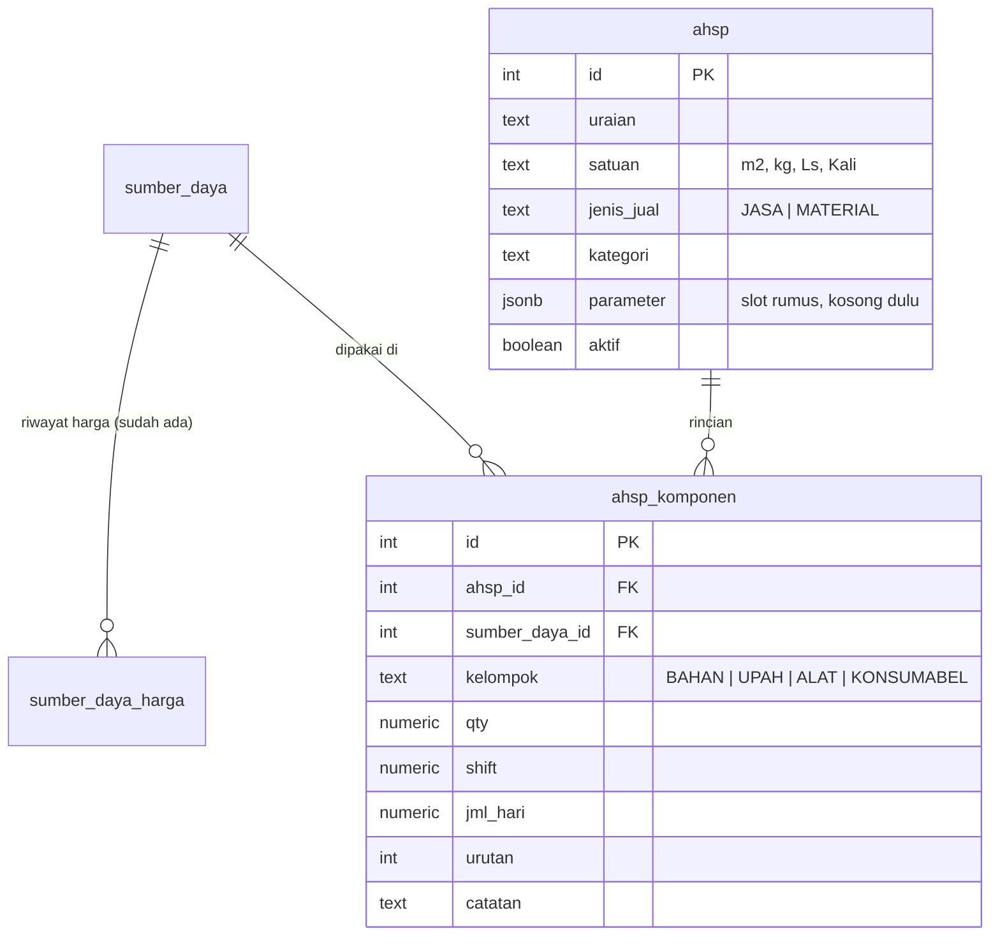

# Analisa Harga Satuan (AHSP) — dasar keputusan tab "Struktur Biaya"

**Status:** fiturnya sudah terpasang dan jalan di produksi. Dokumen ini bukan lagi rencana —
isinya temuan dan keputusan yang tidak bisa diturunkan ulang dari kode.

Yang dibuang saat pemangkasan 3 September 2026: pemecahan sesi kerja 3.0–3.3 (semuanya sudah
selesai), assumption log (sembilan-sembilannya tertutup), daftar larangan per-sesi (sudah jadi
"Keputusan final" di `CLAUDE.md`), dan temuan nomor-baris ke `services/material.py` yang
posisinya sudah lama bergeser.

Penomoran **bagian 2 dan 3 sengaja dipertahankan** — `app/database.py`, `app/schemas/ahsp.py`,
dan `app/services/ahsp.py` merujuk ke nomor itu dari docstring-nya.

**Ruang lingkup yang masih berlaku:** AHSP diisi manual lewat form, satu per satu. Tidak ada
impor Excel untuk AHSP. File Excel di bagian 1 cuma referensi struktur, bukan bahan yang
programnya perlu baca.

Sesi 3.4 (analitik AHSP vs harga realisasi) tidak pernah dikerjakan dan syaratnya belum
terpenuhi: butuh 10+ AHSP terisi dulu. Sekarang baru ada satu.

---

## 1. Temuan dari file Excel asli — `ANALISA_HARGA_SATUAN_-_DR_2020.xlsx`

File aslinya di luar repo. Isinya 3 sheet: **ANALISA HARGA SATUAN** (versi 2017, 57 blok AHSP),
**HPS-SABUK NUSANTARA 49** (dokumen penawaran), dan **DR-2020** (salinan sheet pertama dengan
harga diperbarui ke 2020 — 408 baris berbeda). Semua angka di bawah dihitung ulang dari file,
bukan pembacaan sekilas.

### 1.1 Struktur AHSP — sesuai dugaan, dengan tiga penyesuaian

Tiap blok berbentuk: kode (`DR.01`–`DR.5x`) → uraian kegiatan → **VOLUME** + satuan →
kelompok biaya bernomor, tiap kelompok punya `Sub Total` → `Jumlah harga satuan per <satuan>
( 1 + 2 + 3 )`. Tiga hal yang berbeda dari dugaan awal:

**(a) Urutan kelompok tidak tetap.** Dari 57 blok: 29 urut Upah → Alat → Bahan, 13 hanya
Upah → Alat, 8 hanya Alat, 3 hanya Bahan, 2 Upah → Bahan, 1 Upah → Bahan → Alat. Nomor 1/2/3
mengikuti urutan tampil, **bukan** jenisnya. Ini yang membenarkan keputusan menyimpan `kelompok`
dan `urutan` di baris komponen, bukan menurunkannya dari `sumber_daya.jenis`.

**(b) Baris komponen punya EMPAT pengali, bukan satu koefisien.**
Kolomnya: `Qty` · `Satuan` · `Shift` · `Jml Hari` · `Harga Satuan` → `Total`.
Dari 298 baris komponen, **253 (84,9%)** mengikuti `Qty × Shift × Jml Hari × Harga`.
Sisanya: 24 baris (8,1%) mengabaikan Qty, 18 baris (6,0%) hanya `Qty × Harga`,
3 baris (1,0%) hanya `Jml Hari × Harga`. Tidak ada baris yang tidak cocok dengan salah satu
dari empat pola itu.

→ **`ahsp_komponen` butuh `qty`, `shift`, dan `jml_hari` sebagai kolom terpisah**, bukan satu
`koefisien`. Menggabungkannya jadi satu angka menghapus informasi yang dipakai orang untuk
memeriksa: "4 orang, 1 shift, 0,07 hari" jauh lebih bisa diperiksa daripada "0,28".

**(c) "Jml Hari" itulah koefisiennya**, dan isinya pecahan: 0,002 sampai 5, umum di 0,015 /
0,07 / 0,2. Header kolomnya menulis **"8 jam kerja"**, dan satuan baris upah adalah **"Orang"**
(115 dari 117 baris). Jadi satuan upah = **OH (Orang-Hari), 8 jam per hari** — bukan OJ.

### 1.2 Tidak ada markup sama sekali di tingkat AHSP

Diuji ke seluruh blok: **54 dari 54** blok yang bisa diperiksa punya
`nilai akhir = jumlah seluruh Sub Total`, persis, tanpa selisih. Tidak ada satu pun baris
overhead, keuntungan, risiko, atau profit di mana pun dalam 1.755 baris sheet itu.

Markup satu-satunya ada di sheet HPS, di paling bawah, di tingkat dokumen penawaran:

```
TOTAL ( sebelum PPN ) :   1.726.290.000   ← jumlah 9 sub-total bagian, terverifikasi
PPN 10%               :     172.629.000
TOTAL ( termasuk PPN ):   1.898.919.000
HPS                   :   1.898.919.000
PAGU                  :   1.933.000.000
```

→ **Harga jual = subtotal, apa adanya.** Marginnya sudah tertanam di dalam tarif tiap komponen
(tarif internal sudah termasuk untung), bukan ditambahkan di akhir. PPN di luar lingkup AHSP,
ditambahkan sekali di akhir dokumen penawaran.

> PPN 10% itu tarif 2017. Sekarang 11%. Karena PPN dihitung di tingkat dokumen penawaran dan
> bukan di AHSP, ini tidak memengaruhi rancangan — cukup dicatat supaya tidak ada yang
> menyalin angka 10% ke kode.

### 1.3 Temuan paling penting: subtotal sering tidak sama dengan jumlah barisnya

**48 dari 130 kelompok biaya (37%)** punya `Sub Total` yang tidak sama dengan penjumlahan
baris di dalamnya. Contoh DR.35 (Pengecatan primer, per m²):

| Kelompok | Baris | Jumlah baris | Sub Total tertulis |
|---|---|---|---|
| Tenaga kerja | 3.000 + 1.500 | 4.500 | 4.500 ✓ |
| Peralatan | 3.100 + 800 | 3.900 | **3.100** ✗ (Perancah tidak ikut) |
| Material | 32.400 + 2.080 | 34.480 | **32.400** ✗ (Thinner tidak ikut) |
| **Jumlah akhir** | 4.500 + 3.100 + 32.400 | | **40.000** ✓ bulat |

Pola yang sama di DR.44 (Sandblasting): 14.200 + 45.800 = **60.000**, bulat.
Dari 54 nilai akhir: 48 kelipatan 5.000, 42 kelipatan 10.000, 17 kelipatan 100.000.

→ **Angka akhir ditentukan lebih dulu sebagai angka bulat, lalu komponennya dicocokkan ke
belakang.** AHSP di sini berfungsi sebagai *justifikasi* harga untuk dilampirkan ke penawaran,
bukan sebagai *alat hitung* harga. Baris yang mengganggu kebulatan dibiarkan tercantum tapi
tidak ikut dijumlahkan.

> **Diputuskan 4 Agustus 2026: jumlahkan jujur.** Tidak ada kolom `harga_ditetapkan`, tidak ada
> baris penyesuaian, tidak ada subtotal yang bisa diketik manual. Dua alternatif yang ditolak:
> kolom pembulatan eksplisit dengan baris selisih, dan subtotal yang bisa diketik manual —
> yang terakhir meniru Excel persis tapi menghilangkan seluruh manfaat aplikasi.
>
> Konsekuensinya pindah dari soal kode ke soal komunikasi — lihat bagian 5.

### 1.4 HPS tidak terhubung ke AHSP

Kolom harga satuan di sheet HPS **diketik manual**, nol rumus lintas-sheet. Kalau AHSP diperbarui,
HPS tidak ikut berubah, dan sebaliknya. Sheet `DR-2020` juga bukan pembaruan sheet 2017 melainkan
salinannya dengan harga diketik ulang.

→ Pain point nyata: **harga diketik ulang di dua tempat.** Menyelesaikannya berarti membangun
modul penawaran, yang sampai sekarang belum ada.

### 1.5 Yang tidak jadi masalah

- **Tidak ada baris subkontraktor** di seluruh file — semua dikerjakan sendiri.
  `JASA` tidak perlu ditambahkan ke `sumber_daya.jenis`.
- **Tidak ada mata uang selain rupiah** di file ini. Aturan 3.2 tetap dipertahankan sebagai
  penjagaan, tapi risikonya lebih rendah dari dugaan.
- **Satuan yang dijual** bervariasi bebas: M² (14), Unit (13), Kali (7), Hari (7), Ls (7), Set,
  Bh, Ton, Jam, Ttk, Kg. Kolom `ahsp.satuan` sebagai TEXT bebas sudah tepat.
- **Kolom VOLUME** di tiap blok (mis. 980 M²) itu volume proyek tertentu, bukan bagian dari
  AHSP-nya. Tidak disimpan di tabel `ahsp` — tempatnya nanti di dokumen penawaran.

---

## 2. Model data

Dirujuk dari docstring `app/database.py` dan `app/schemas/ahsp.py`.
**DDL yang berlaku ada di `ensure_ahsp_tables()`** di `backend/app/database.py`, bukan di sini —
salinan DDL di dokumen cuma mengundang perbedaan diam-diam.



### Kenapa begini

- **`ahsp` berdiri sendiri, tidak nempel ke `tabel_katalog_harga`.**
  Tabel lama isinya harga realisasi historis: satu uraian muncul puluhan kali beda kapal dan
  tahun. Memaksa relasi ke sana berarti harus beresin data lama dulu — pekerjaan besar yang
  tidak diminta. Perbandingan HSP vs harga jual realisasi ditunda, dan waktu itu pun cocokannya
  lewat teks, bukan foreign key.

- **Tidak perlu `jenis` baru sama sekali.** Yang dipakai adalah sumber daya **milik Dukuh Raya
  sendiri**, bukan jasa yang dibeli dari luar. Empat jenis yang sudah ada (`BAHAN`, `UPAH`,
  `ALAT`, `KONSUMABEL`) menampung semuanya — tukang sendiri masuk UPAH, kompresor/crane/dock
  sendiri masuk ALAT, oksigen dan elektroda masuk KONSUMABEL.

- **Tapi "harga satuan" untuk UPAH dan ALAT artinya beda.** Untuk bahan, harganya datang dari
  quotation supplier. Untuk alat dan tenaga kerja milik sendiri tidak ada supplier — angkanya
  adalah **tarif internal** yang ditetapkan manajemen (mis. kompresor Rp 150.000/jam sudah
  termasuk solar dan penyusutan). Karena itu `supplier_id` NULL dan kolom `sumber` diisi
  "Tarif internal". Siapa yang menetapkan dan meninjau tarif ini masih belum ada jawabannya.

- **`kelompok` disimpan di komponen, bukan diambil dari `sumber_daya.jenis`.**
  Barang yang sama bisa masuk kelompok berbeda tergantung pekerjaannya (oksigen bisa bahan di
  satu pekerjaan, konsumabel di pekerjaan lain). Ini juga yang bikin urutan A/B/C di lembar
  AHSP bisa diatur tanpa mengubah master.

- **`parameter JSONB` sengaja dikosongkan.** Kalau suatu saat ada rumus, isinya masuk situ
  tanpa perlu migrasi kolom.

- Normalisasi di `uq_ahsp_uraian` sengaja sama persis dengan pola `sd_identitas_sql()` yang
  dipakai material — biar aturan "dianggap kembar" konsisten di seluruh aplikasi.

---

## 3. Tiga aturan hitung yang wajib dipatuhi

Dirujuk dari docstring `app/services/ahsp.py`, dan dijaga di sana. Ini bukan preferensi —
ketiganya masalah yang akan menghasilkan angka salah kalau dilanggar.

### 3.1 Harga hilang JANGAN dijadikan nol

Kalau satu komponen belum punya baris di `sumber_daya_harga`, subtotal **tidak boleh**
di-`COALESCE(..., 0)`. Nanti AHSP terlihat sudah jadi padahal separuh biayanya hilang, dan tidak
ada yang sadar. Yang benar: kembalikan `harga_satuan: null` untuk komponen itu, tandai AHSP
sebagai `lengkap: false`, dan sebut komponen mana yang bolong. Subtotal tetap dihitung dari yang
ada, tapi harga jual tidak boleh dikeluarkan.

> Ini pengulangan pelajaran dari parser docking: batas yang diam-diam memotong data lebih
> berbahaya daripada error yang berisik.

### 3.2 Hasil akhir selalu rupiah — dan itu bukan berarti boleh dikonversi diam-diam

Operasi Dukuh Raya berjalan di Lombok dan justifikasi harganya selalu rupiah. Masalahnya,
`sumber_daya_harga.mata_uang` menerima `IDR`, `EUR`, `USD`, dan datanya memang sudah ada yang
non-IDR — tab Analitik bikin satu grafik per mata uang justru karena itu.

Konversi butuh kurs, dan kurs butuh tanggal + sumber yang disepakati. Menebak kurs berarti
mengubah harga diam-diam. Jadi: kalau ada komponen yang harga terkininya bukan IDR, AHSP itu
ditandai `lengkap: false` dengan alasan yang menyebut komponennya. **Jangan dijumlahkan, jangan
dikonversi.** Jalan keluar termurahnya bukan tabel kurs, tapi mencatat harga rupiah yang
benar-benar dibayar waktu barang itu dibeli — angkanya pasti ada di invoice, dan lebih akurat
daripada kurs rata-rata mana pun.

### 3.3 Rumus dihitung di backend saja

Frontend **tidak boleh** menghitung ulang harga jual. Kalau rumus ada di dua tempat, suatu saat
keduanya beda dan tidak ada yang tahu mana yang benar. Frontend boleh menjumlahkan
`qty × shift × jml_hari × harga` untuk pratinjau live saat mengetik, tapi angka final selalu
datang dari endpoint `/ahsp/{id}/hitung`.

---

## 4. Rumus harga jual

`hitung_harga_jual()` di `backend/app/services/ahsp.py` adalah **satu-satunya tempat rumus harga
jual boleh ditulis**, dan isinya penjumlahan biasa: `sum(subtotal.values())`. Jangan menambahkan
persentase apa pun "karena biasanya ada" — di perusahaan ini memang tidak ada (bagian 1.2).

Balasan `/ahsp/{id}/hitung` memuat `subtotal` per kelompok, `subtotal_total`, `harga_jual`,
`lengkap`, `alasan[]`, dan `rumus_terpasang`. Yang terakhir selalu `true` sekarang, tetap
dipertahankan supaya kalau suatu saat klien memakai markup, penandanya sudah ada dan frontend
tidak perlu diubah. Biayanya satu boolean.

Yang wajib tampil terang-terangan di UI: **angka ini belum termasuk PPN.** Karena harga jual
sama persis dengan biaya modal, angkanya mudah disalahartikan sebagai harga final ke pelanggan.

---

## 5. Risiko yang masih berlaku

**Aplikasi ini menghasilkan angka yang berbeda dari Excel, dan itu bukan bug.**
Karena 37% kelompok punya subtotal yang tidak sama dengan jumlah barisnya (bagian 1.3),
aplikasi yang menjumlahkan dengan benar memberi angka lebih tinggi di banyak pekerjaan.
Kalau ini tidak dibicarakan lebih dulu, reaksi pertama orang lapangan adalah "aplikasinya salah
hitung" — padahal Excel-nya yang tidak konsisten. Kepercayaan hilang di minggu pertama, dan
susah dikembalikan.

Ini pekerjaan komunikasi, dan **belum dikerjakan**: sebelum aplikasinya dipakai memberi harga ke
pelanggan, orang yang selama ini memegang Excel harus diberi tahu bahwa angkanya akan naik di
sebagian pekerjaan, **dengan satu contoh konkret di tangan** (DR.35: 40.000 jadi 42.080, karena
Thinner dan Perancah ikut). Menemukan sendiri selisih itu di layar jauh lebih merusak
kepercayaan daripada diberi tahu di depan.

Risiko kedua: file itu dari 2017/2020 dan berisi satu kapal. Struktur AHSP-nya kemungkinan besar
mewakili cara kerja umum, tapi belum tentu semua pekerjaan yang ada sekarang. Cukup untuk mulai;
tidak cukup untuk dianggap lengkap.

---

## 6. Keputusan yang tercatat

### Harga komponen hidup, tidak dibekukan (4 Agustus 2026)

Harga komponen mengikuti Katalog Material secara hidup — `hitung()` selalu membaca
`v_harga_terkini`. Alasannya: AHSP itu **template justifikasi**, bukan dokumen yang dikirim ke
pelanggan. Yang sebenarnya perlu dibekukan adalah penawaran yang keluar dari AHSP, dan modul
penawaran belum ada (bagian 1.4). Membekukan di lapisan yang salah membuat AHSP jadi usang
diam-diam tanpa ada yang tahu sejak kapan.

> **Utang yang dicatat, bukan dibayar sekarang:** begitu modul penawaran dibangun, penawaran
> yang sudah terkirim wajib menyimpan angkanya sendiri — jangan menghitung ulang dari AHSP
> waktu dibuka lagi. Kalau nanti ternyata AHSP juga perlu versi beku, `ahsp_komponen` tinggal
> ditambah kolom (`harga_dikunci NUMERIC NULL` + `dikunci_pada`) lewat pola
> `ADD COLUMN IF NOT EXISTS`. Tidak ada yang perlu dibongkar.

### Tambah komponen baru langsung dari layar AHSP (4 Agustus 2026)

Ketik nama yang belum ada → muncul opsi "buat baru" → isi nama, satuan, dan harga awal di situ
juga → tersimpan sebagai baris `sumber_daya`, lalu langsung terpakai sebagai komponen. Bukan dua
langkah lewat tab Katalog Material.

Barang itu otomatis muncul juga di tab Katalog Material. Itu disengaja: satu tabel dilihat dari
dua layar. Komponen yang lepas dari katalog pusat justru mengundang pengetikan ulang, pain point
yang sedang dihindari seluruh proyek ini.

**Risiko yang diterima, dan penjaganya.** Duplikat "Cat Epoxy" vs "Cat Epoxy 5kg" tetap lolos
`uq_sd_identitas` — index itu menolak yang **persis sama** setelah dinormalisasi, bukan yang
mirip. Jadi penjaganya ada di lapisan saran, dan sengaja lebih longgar daripada normalisasi
index:

- Cari dengan `GET /material?jenis=<kelompok>&search=` (ILIKE `%...%` pada nama dan
  spesifikasi), **bukan** dengan normalisasi `uq_sd_identitas`. Yang terakhir cuma menangkap
  kembar persis, padahal yang mau dicegah justru yang tidak persis.
- Cari pakai **dua kata pertama** dari yang diketik, bukan seluruh teksnya. Mengetik
  "Cat Epoxy" memang menemukan "Cat Epoxy 5kg" karena substring, tapi arah sebaliknya tidak:
  mengetik "Cat Epoxy 5kg" tidak akan menemukan "Cat Epoxy" yang sudah ada. Memotong ke dua
  kata pertama menutup arah kedua itu.
- Tampilkan hasilnya **lebih dulu**, dan taruh "buat baru" di bawahnya — bukan sebaliknya.

### Pain point yang dicatat, belum dikerjakan

Harga satuan di sheet HPS diketik ulang manual dari sheet AHSP — nol rumus penghubung. Sheet
DR-2020 juga salinan manual dari versi 2017. Pengetikan ulang di dua tempat adalah penanda pain
point yang kuat, tapi menyelesaikannya berarti membangun modul penawaran.
